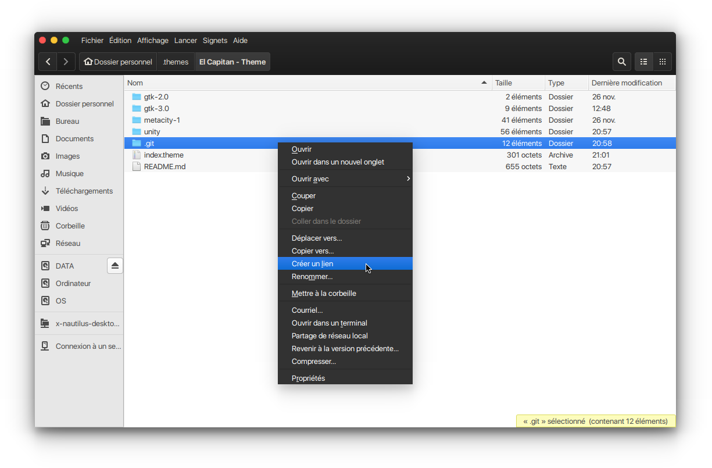

## El Capitan Theme
<!--

> Font used in the screenshot is [San Francisco](https://github.com/supermarin/YosemiteSanFranciscoFont) and the icon pack is [`el-capitan-icons`](https://github.com/yboyer/el-capitan-icons).
-->


### Installation
Clone the repo into your `~/.themes` directory and enable it with `gnome-tweak-tools` or `unity-tweak-tool`.
```bash
git clone https://github.com/yboyer/el-capitan-theme '~/.themes/El Capitan - Theme'
```


### See also
  - Icons: [`el-capitan-icons`](https://github.com/yboyer/el-capitan-icons)
  - Cursor: [`el-capitan-cursor`](https://github.com/yboyer/el-capitan-cursor)
